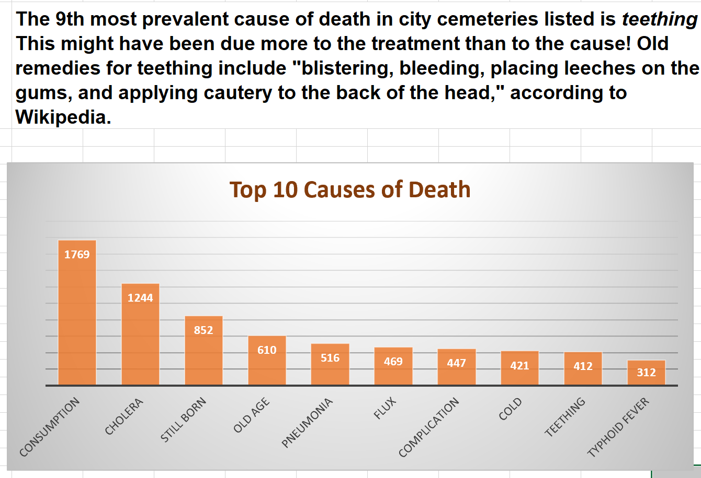

The Nashville City Cemetery Association has asked you to create marketing materials. The following exercises are a _starting point_ for exploring the data and creating visualizations. Once you have completed the exercises below, create additional visualizations to accompany storytelling points. An example of this is shown below for the first exercise.

The city of Nashville provides a dataset of known burials in city cemeteries from 1846 through 1979. This dataset holds factual information, but it also offers a fascinating glimpse into historical trends in medicine, literacy, racial equality, and more.

1.	Use a pivot table to find the 10 most common (known) recorded causes of death, and evaluate the counts of each type. Once you have your metrics, plot these in a **bar chart**. In the analysis of the top 10 causes of death, you may see spelling mistakes that are affecting your counts. For example, you can assume Cholera and Cholrea are the same cause of death. Create a new column in the original dataset to update spelling errors to make your count of the top 10 causes more accurate. You will need to **refresh your pivot table** to see changes applied. (For the new column you create, copy the column with `Cause of Death/Burial` and correct spelling errors only for causes that appear in your top 10 list).

2.	Create a line chart showing number of burials per year. In what years were there the most burials? Can you think of any plausible reason why?

3. Examine deaths for each decade beginning with the 1850s. Look at the total number of deaths and the proportion of male deaths to female deaths. Use a **pivot table** with a **slicer** to do this, and create a clustered bar chart to show how male and female deaths have changed over time.

4. Next look at how age at the time of death has changed over time. Add a column to the original dataset to classify each row to one of the following categories (0-18, 19-25, 26-40, 41-64, and 65+). Be sure to think about a strategy to deal with missing values. Make a series of pie charts or donut charts to show the breakdown of each age group for these four periods: before 1880, 1881-1900, 1900-1920, after 1920.

5. Examine burials by month. Are there months with higher burials? What are the top five causes of death for each month? Choose a visualization that conveys the differences well.

6. Create a new column titled Last Name. Extract the last name from the Name column by subsetting to all characters to the left of the comma (see the DataCamp exercise titled “String Information – LEN, SEARCH” from the Data Analysis with Spreadsheets if you need help with this). This will result in many errors for rows missing commas.   
    a. 	Drill down to those rows without a comma – what do you notice?  
    b.	What are the most common last names of people buried in this cemetery?  
    c.	There was a particularly famous person buried in this cemetery. Can you find that person?

7. Do you notice any interesting patterns regarding where (`Section/Lot`) people were buried?

#### Create a new sheet for each pivot table or analysis work done to create a visualization and give each sheet a descriptive/meaningful name. Your final product should be marketing material that includes one or two visualizations that go along with your story. 
