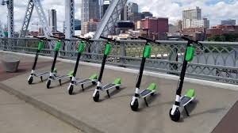

### Transportation Planning for Nashville: How Many Scooters are Optimal?
 * What is the ideal density of available scooters to:
    1.  enable scooters to serve our transportation goals
    2. discourage scooters piling up on sidewalks
    3. keep it economically viable for companies to operate equitably in the city?
### Points to consider
* A major planning goal is to reduce the number of people driving alone
* Three rides (of 3 meters or more) per day per scooter is the baseline for ridership goals
* The original pilot program limited scooter density to 340 scooters per square mile


### Data
Six scooter datasets are [available for your analysis](https://drive.google.com/drive/folders/10u81gy8_dWs77c-Kbk8IqjW9Vmgo8PEJ?usp=sharing). The polled location datasets have between 20 and 30 million rows of data each.
1. `may.csv` - May 2019 polled location
2. `june.csv` - June 2019 polled location 
3. `july.csv` - July 2019 polled location
4. `may_trip.csv` - May 2019 trips
5. `june_trip.csv` - June 2019 trips
6. `july_trip.csv` - July 2019 trips
  

**pubdatetime** - date and time that the device was polled  
**latitude** - latitude location of device when polled  
**longitude** - longitude location of device when polled  
**sumdid** - unique identifier for the device  
**sumdtype** - one of two types (powered or standard)  
**chargelevel** - battery charge level of the device when polled  
**sumdgroup** - type of device (scooter or bicycle)  
**costpermin** - the cost per minute of device use  
**companyname** - the company that owns the device  
- Bird  
- Lyft  
- Gotcha  
- Lime  
- Spin  
- Jump  
- Bolt

Per [ordinance](https://www.nashville.gov/Metro-Clerk/Legislative/Ordinances/Details/7d2cf076-b12c-4645-a118-b530577c5ee8/2015-2019/BL2018-1202.aspx): 
```
All permitted operators will first clean data before providing or reporting data to Metro. Data 
processing and cleaning shall include:  
 1. Removal of staff servicing and test trips
 2. Removal of trips below one minute
 3. Trip lengths are capped at 24 hours
 ```
Anecdotally, per metro ITS staff, some of these observations may still be in the data.

#### Shapefiles for Nashville Promise Zone 
SUMD devices are thought to be of particular use in the [Promise Zone](https://www.nashville.gov/Mayors-Office/Promise-Zone/Basics.aspx) to help mitigate the "last mile" problem that exists in connecting people where they live to public transportation.

Remember that you need to keep the shapefiles together. Even though you will point to the `.shp` file to create polygons, that file references other files in the `MDHA_Promise_Zones` folder to create the geoDataFrame.
