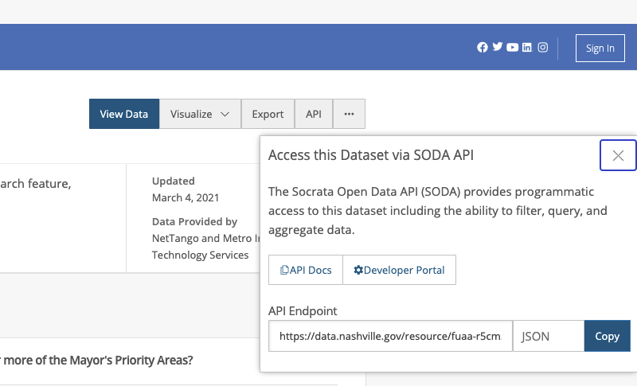

# Socrata API

For this project you will use the SODA API to access data through https://data.nashville.gov/. We'll start out with something familiar, the Top 500 Monthly Searches, then pull in different datasets further on. You will make different API requests for each individual question.

Each dataset has its own api endpoint. You can find the endpoint for a dataset by clicking on the `API` button in the top right of the dataset screen, then copying the `API Endpoint`:

Each API is different, so it is very important to read the documentation for each API to know how to use it properly. The documentation for the SODA API is here: https://dev.socrata.com/consumers/getting-started.html. It is **HIGHLY RECOMMENDED** that you read the documentation before making any requests, then do deeper dives into specific use cases when questions require.

#### Questions

1. Make an API request that returns the entire Top 500 Monthly Searches dataset. Make a chart that shows the number of times "maps" was searched in a month across the entire time frame.  

2. Make an API request that returns the months where "fire" was searched in 2016. Which month had the most searches?  

3. Make an API request that returns all the times a query was run more than 100 times in a month. How many times did this occur?  

4. Make another API request that returns all the times "codes" was searched more than 100 times in a month. How many times did this occur?  

5. Make an API request to pull back all the data from hubNashville (311) Service Requests (The full data set is too big for a single request so you will need to combine the output from multiple requests). Compare it to the Top 500 Monthly Searches data set. What do you observe? (This is open-ended, there isn't a specific answer for this one)  

6. Find 2 new data sets on data.nashville.gov, make API requests to pull the data, and do an analysis that combines the data sets.  

**BONUS**: Socrata is used by many cities, states, and federal organizations. Find additional datasets through Socrata's Open Data Network (http://www.opendatanetwork.com/) and do an analysis comparing them to Nashville or each other.
