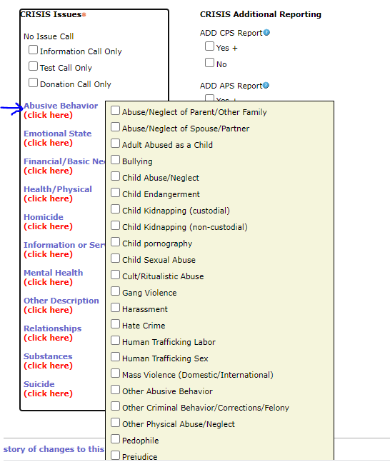

# Family and Children's Service Crisis Call Center

For this project, you have been provided data from the Crisis Call Center operated by [Family and Children's Service of Nashville](http://www.fcsnashville.org/). Crisis counselors assist callers struggling with thoughts of suicide, grief, depression, anxiety, domestic violence, addiction, or trauma. 

The first set of data you have been provided with is contained in the two files `NSSCrisisv.1.xlsx` and `NSSCrisisv.2.xlsx`, which contain records for calls to the Crisis Call Center from 2020 through April, 2022. 

Your objectives for this dataset are as follows:
1. Examine call volume and identify surge times, seasons, or events.
2. Analyze trends in call content by looking for which issues are most frequent and what is the average count of issues per call.
3. Assess regional and demographic trends in call content and call volume.
4. Determine the count and success rate of imminent risk calls.

For the second objective, the columns that contain the information about the documented issues are those that begin with `CRISIS Issues`. When calls come in, call takers use a form to indicate the various issues the individual is experiencing: 

If an individual is experiencing multiple issues, the issues can be grouped together into a single cell, which makes understanding individual issues difficult. For this project you will parse the data from the different `CRISIS Issues` columns to allow deeper investigation of each individual issue. 

You have also been provided with the dataset `Contact center call volume_2020-2022.xlsx` which contains call volume data from the phone system, which shows not just answered calls but also missed, abandoned, and transferred calls. Using this data, try and identify any potential staffing gaps.