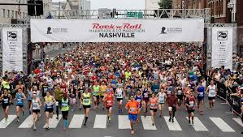

### web-scraping-marathon_data


The data for the Nashville Rock-and-Roll Marathon that you worked with in Excel was scraped from the `www.runrockroll.com` race results page. Now it's **your turn** to scrape the data from the website! The number of pages of results *for each race* and the base URL that you will build out is provided below. Each page has 50 rows, so you will need to indicate how many rows to skip when pulling each page.

#### Counts of result pages and base urls for 3 years of Marathon results 

```
Number of pages of results

pgs_2019 = 57
pgs_2018 = 43
pgs_2017 = 74

```  

```

Base URLs for each race results page

urlbase_2019 = 'https://api.competitor.com/public/result/subevent/622BBEE3-D94F-E811-941E-005056951BF1?$limit=50&$sort[FinishRankOverall]=1&$skip='
urlbase_2018 = 'https://api.competitor.com/public/result/subevent/DEDEEE82-E676-E711-9418-005056951BF1?$limit=50&$sort[FinishRankOverall]=1&$skip=''
urlbase_2017 = 'https://api.competitor.com/public/result/subevent/9D1CE788-E676-E711-9418-005056951BF1?$limit=50&$sort[FinishRankOverall]=1&$skip='
```  

In addition, you will need to add an additional argument when using `requests.get()`. Include `headers = {'WTC_PRIV_KEY': '90da38d91a0648f89823e375a43b2dc8'}` to the function call.


```
Expected number of rows:

2019 = 2811
2018 = 2115
2017 = 3651

```


**After loading the marathon and half-marathon data to DataFrames in Python, perform EDA as usual. Think of a question that you find interesting and answer it by exploring the data. Prepare a brief (5 minutes) presentation to share what you find.**


